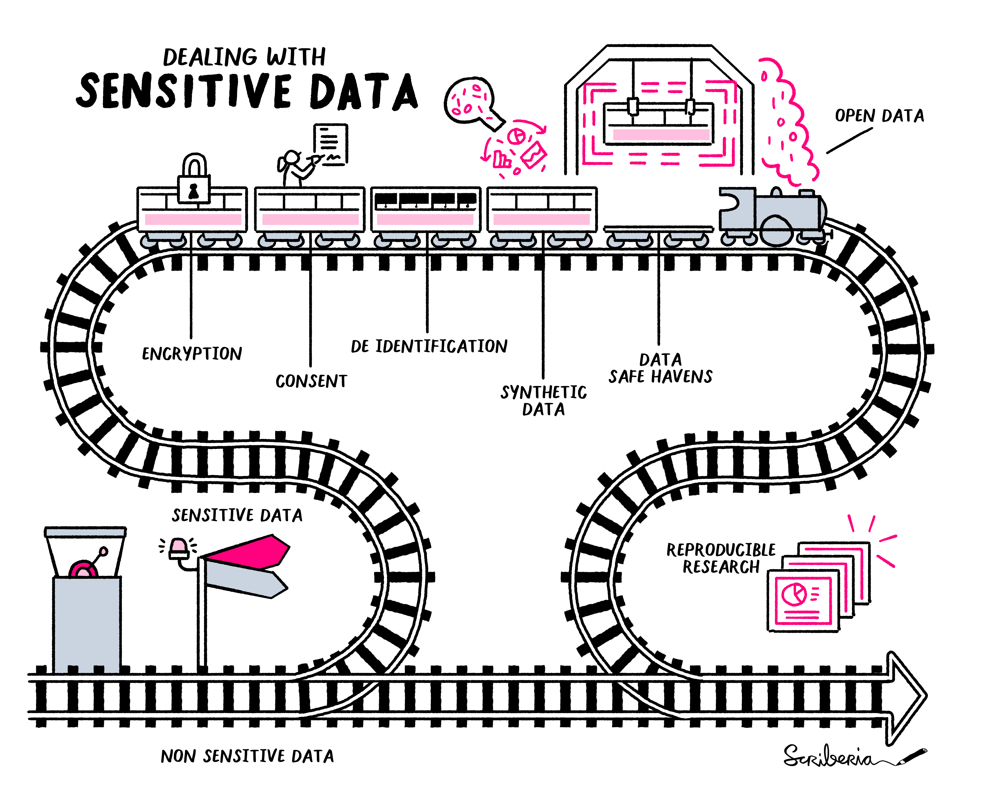
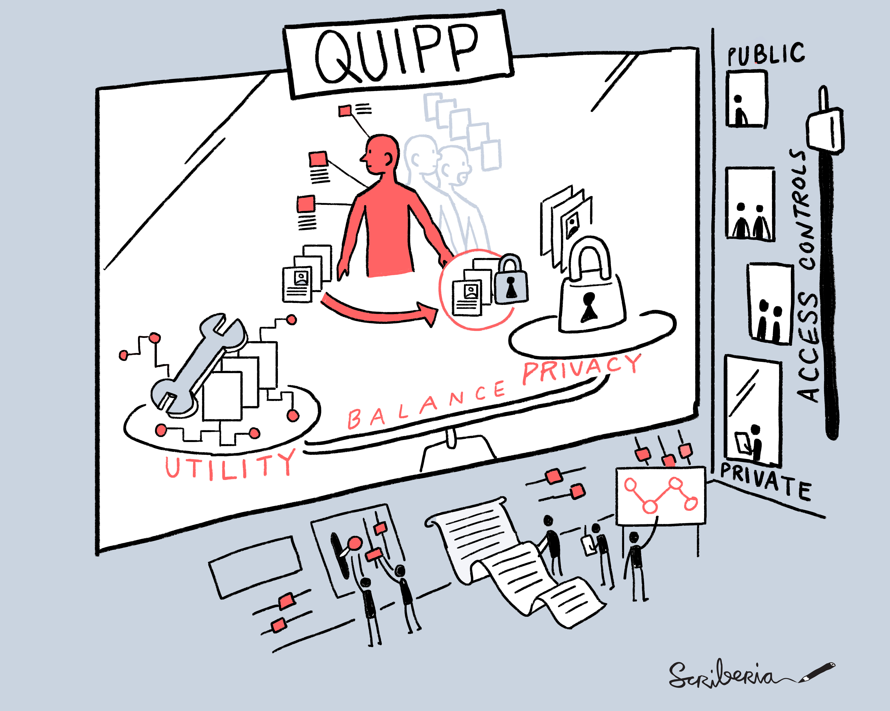

Synthetic Data: Applications in health-care and biomedical research
===

## What is synthetic data?

*Synthetic data are artificially generated data which replicate original features and patterns of real-world data.*

There are lots of different ways of defining synthetic data, depending on the context.

What about dummy, test, or toy data? See the [understanding terminology](1a-understanding-terminology.md) file for more reflections.

  
Click for more definitions of synthetic data
  
   
  
  > "Synthetic data is data that has been generated using a purpose-built mathematical model or algorithm, with the aim of solving a (set of) data science task(s)."[^1] 
   
 > "Synthetic health data is artificially generated data which is used to replicate the original components of real-world health data. Synthetic data is created, or simulated, rather than being generated by real world health events."[^2] 
  
> "Conceptually, synthetic data are artificial data that mimics the properties of and relationships in real data. The quality of synthetic data depends on the approach taken to synthetic data generation."[^3] 
  
> "Synthetic data are microdata records created to improve data utility while preventing disclosure of confidential respondent information. Synthetic data is created by statistically modelling original data and then using those models to generate new data values that reproduce the original data’s statistical properties …" Source: US Census Bureau[^4] 

  
Using computer-generated data to solve tasks is not a new idea; simulation and modelling approaches have been used for decades in science and technology spaces. However, newer developments relate to the *application* of synthetic data, particularly in the context of managing the disclosure risk of sensitive health care data. 

## When can't we use the real data?

Within a research context, it can be confusing if data that is perceived as 'fake' or 'made up' is used instead of real data. We always would like to use the real data, and the real data is what we should use to make final conclusions and decisions. However, there are points along the research process where it is challenging to use the real data (for example, privacy concerns) and a synthetic version (that matches the real data in some way but is *not* the real data) may help researchers and other users of this data. 

---

  
 Click for more information on applications of synthetic data, in the context of health datasets

   

  > Health databases can contain information about a large group of people, making the hosting and sharing of these databases challenging. It can be hard to share real data when it contains sensitive personal information about individuals - we do have some good anonymisation approaches to remove the risk of disclosure, however some risk will always remain. Accessing these databases can also cost money.
  
  > For these reasons, and more, scientists working in health-care and biomedical research have sought to overcome some of these privacy concerns by generating synthetic versions of datasets of interest. In theory, the synthetic data should be safer and easier to access, therefore allowing researchers to learn the structure, features and patterns of the real dataset without actually accessing it directly. Easier and earlier access should facilitate promotion of these datasets, training of people and acceleration/refinement of research workflows. In the context of AI, high fidelity synthetic data can be used to train and validate machine learning models; synthetic datasets can be created to be different to the real data in specific ways to address a certain bias in the real data, for example under-sampling of sub-groups within a population. 

 

 
---

## Common terms and concepts
- **Utility**: How useful the synthetic dataset is for a specific task or tasks, which will be application-dependent. 
- **Fidelity**: The degree to which the synthetic dataset matches the statistical properties of the real data (often used interchangeably with utility). 
- **Privacy**: The amount of information the dataset contains about real data. Synthetic data can be created to mitigate disclosure risk (disclosure of confidential data about an individual).
- In general, utility and fidelity change together, and disclosure risk increases with higher fidelity. However, not always! This is because disclosure risk is dependent on the approach/methodology used to generate the synthetic data. 

## Trade-offs and challenges
- The quality of the real data can determine the quality of the synthetic data, retaining biases and errors.
- There is a trade-off between utility, privacy, and how difficult the synthetic data is to generate.
- Synthetic data is categorised in different ways. This can be in terms of how closely it resembles the real data, but also by which methods were used to generate it.
- We need to appropriately communicate what synthetic data is and isn't to different audiences, so that it is a trusted resource.
- We need to use consistent terminology and methodologies, where possible.
- We need to appropriately adapt data governance: it is not a replacement for real data, and should be easier to get access to and work with. 
- Synthetic data has great potential in the context of the use of sensitive personal data in research, however synthetic data is not automatically private. For example, outliers remain hard to represent in a synthetic dataset in a private way, and evaluating the privacy of a model/dataset can be challenging. Privacy is a big topic - see reference [^1].

### References

[^1]: ['Synthetic Data - what, why and how?’ (2022)](https://arxiv.org/pdf/2205.03257.pdf). Report commissioned by Royal Society, with synthetic data experts at The Alan Turing Institute. Focuses on the current state of the rapidly expanding work on synthetic data technologies, with a particular focus on privacy.

[^2]: [‘Understanding Synthetic Data, A guide for SMEs’ (2022)](https://breathedatahub.com/news-opinion/synthetic-data-guide-smes). A comprehensive guide on synthetic data in the context of health data research covering: the defining features of synthetic data, its use-cases and examples of how data can be synthesised. Advantages, benefits, challenges & limitations.

[^3]: [‘Synthetic data and the innovation, assessment, & regulation of AI medical devices’ (2022)](https://cprd.com/sites/default/files/2022-12/Myles%20et%20al.%20preprint_2022.pdf). This paper outlines efforts by the MHRA to research and develop synthetic data and consider its use in the context of wider reforms to ensure medical device regulation is fit for purpose for AI.

[^4]: [‘ONS methodology working paper series number 16 - Synthetic data pilot’ (2021)](https://www.ons.gov.uk/methodology/methodologicalpublications/generalmethodology/onsworkingpaperseries/onsmethodologyworkingpaperseriesnumber16syntheticdatapilot). Data and analysis from Census 2021. A pilot study investigating the demands and requirements for synthetic datasets and exploring possible tools to produce synthetic data for specific user requirements.  

