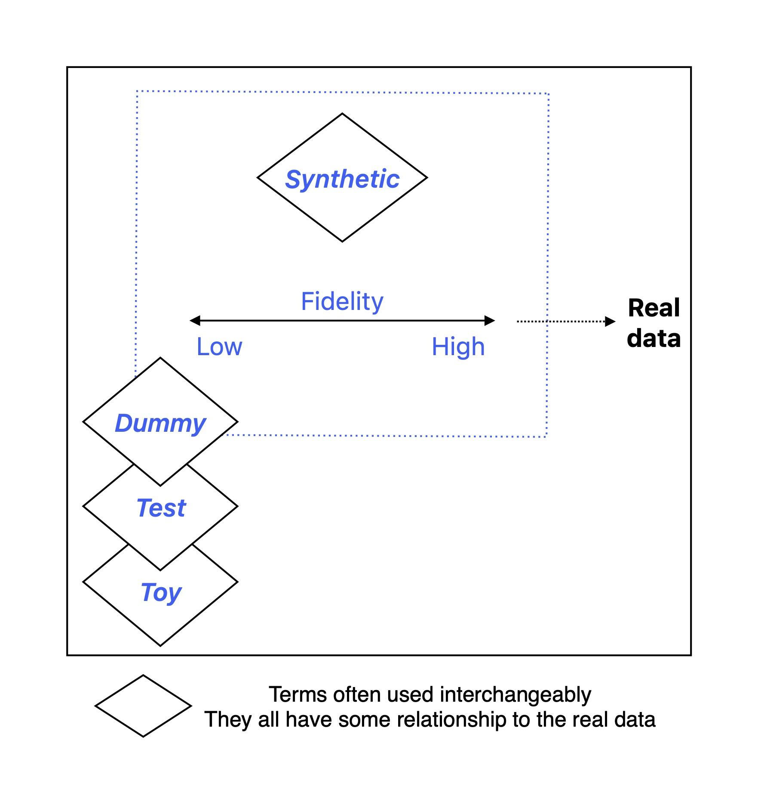

# Understanding terminology 

**Synthetic** data matches statistical properties of the real data to a certain degree (a low to high match or **fidelity**). 

The **low-fidelity** space is less well defined and some people refer to this data as **dummy**, **test** or **toy** data. Dummy, test or toy data may be randomly generated data that only matches the *structure* of the dataset, and not any of its statistical properties.

The **high-fidelity** space is more defined as it is closer to the **real data**, with narrower use cases.

