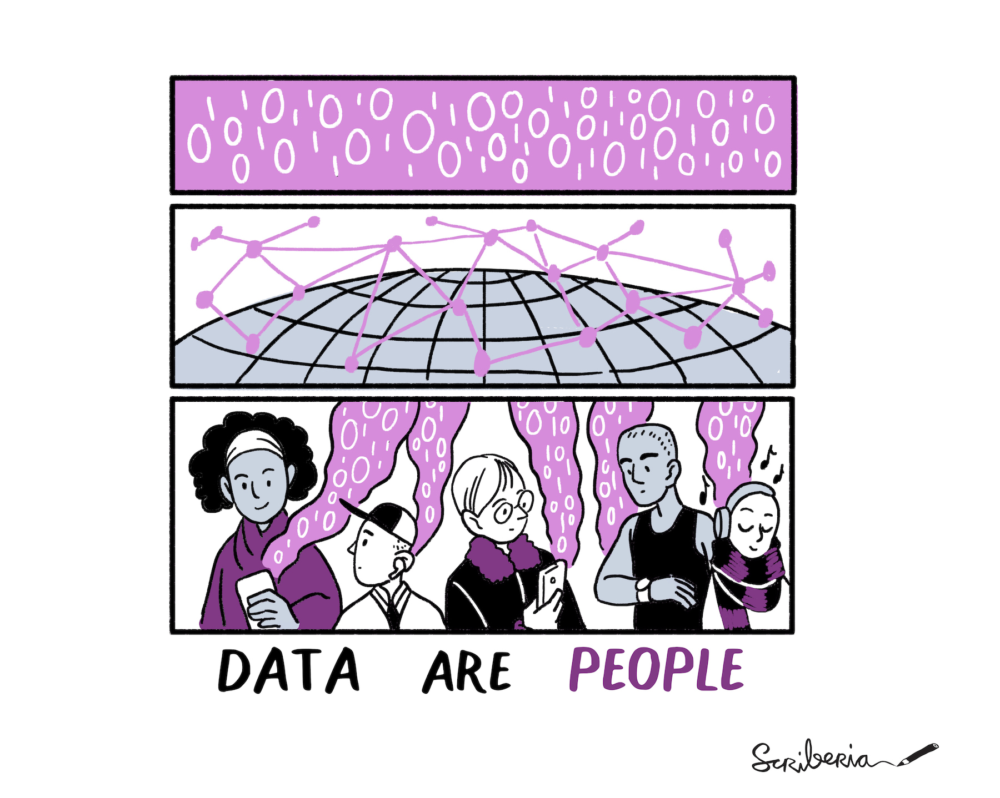
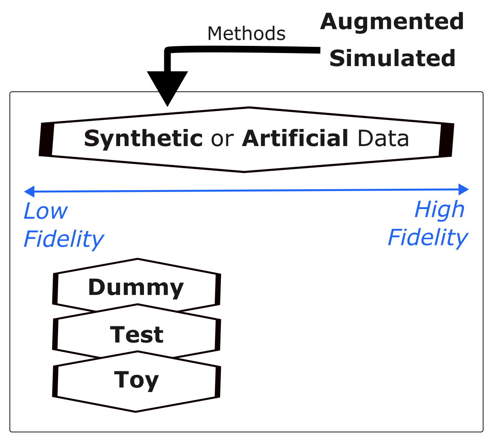
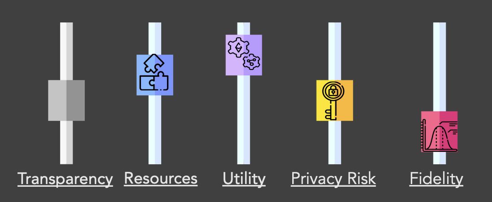

<!-- ALL-CONTRIBUTORS-BADGE:START - Do not remove or modify this section -->

<!-- ALL-CONTRIBUTORS-BADGE:END -->

[![CC BY 4.0][cc-by-shield]][cc-by]

# Demystifying Synthetic Data 

Synthetic data has great potential to speed up biomedical research. There are many detailed resources and references on synthetic data and its use-cases, see [References and Resources](references-and-resources.md) for some places to start. 

This page aims to demystify the terminology used in this area and provide an introduction to key use-cases and challenges of synthetic data. This is done in the form of a question and answer structure - **click on each question below to see the answer.** The 🎨 symbol indicates there is a diagram or illustration in this answer. 

---

  
What is synthetic data?
  
   

  > Synthetic data are artificially generated data which replicate original features and patterns of real-world data.
  

 

  
How is synthetic data defined?
  
   

  > There are various definitions of synthetic data. Here are 3 examples:
  > 
  > "Synthetic data is data that has been generated using a purpose-built mathematical model or algorithm, with the aim of solving a (set of) data science task(s)."([Reference 5](references-and-resources.md)) 
  > 
  > "Conceptually, synthetic data are artificial data that mimics the properties of and relationships in real data. The quality of synthetic data depends on the approach taken to synthetic data generation."([Reference 6](references-and-resources.md)) 
  >
  > "Synthetic data are microdata records created to improve data utility while preventing disclosure of confidential respondent information. Synthetic data is created by statistically modelling original data and then using those models to generate new data values that reproduce the original data’s statistical properties …" Source: US Census Bureau, ([Reference 1](references-and-resources.md)) 

  

 

  
Is synthetic data a recent development?
  
   

  > No. Using computer-generated data to solve tasks and generate new data is not a new idea; simulation and modelling approaches have been used for decades in science and technology spaces. However, newer developments relate to the application of synthetic data, particularly relating to the growing use case of using it to managing the disclosure risk of sensitive health care data. 

 

  
Why can't we use just use the real data? 🎨 
  
   
  
  > It can be confusing if 'made up' data is used instead of real data. In nearly all situations, the real data is what we should use to make final conclusions and decisions. However, there are points along the research process where it is challenging to use the real data (for example, privacy concerns) and a synthetic version (that matches the real data in some way but is not the real data) may help researchers and other users of this data.
  >
  > Health databases can contain sensitive personal information about a large group of people, making the hosting and sharing of these databases challenging. We do have some good anonymisation approaches to remove the risk of disclosure, however some risk will always remain. Accessing these databases can also cost money.
  > 
  > For these reasons above, and more, scientists working in health-care and biomedical research have sought to overcome some of these privacy concerns by generating synthetic versions of datasets of interest. In theory, the synthetic data should be safer and easier to access, therefore allowing researchers to learn the structure, features and patterns of the real dataset without actually accessing it directly. Easier and earlier access should facilitate promotion of these datasets, training of people and acceleration/refinement of research workflows. 
  > 
  > In the context of AI,  synthetic data that closely match the statistical properties of the real data can be used to train and validate machine learning models; synthetic datasets can be created to be different to the real data in specific ways to address a certain bias in the real data, for example under-sampling of sub-groups within a population.

  

 

  
Synthetic, Artificial, Dummy, Test, Toy - are these all the same? 🎨 
  
   
  
  > Many terms are used interchangeably. Synthetic data and Artificial data typically refer to the same concept; often synthetic data is said to be artificially generated. Simulated data or Augmented data are sometimes used in replace of synthetic data, but can be best thought of as methods used to generate the synthetic data i.e. via simulations and mathematical modelling. The low fidelity space can be less well defined and some people refer to this data as Dummy, Test or Toy data. These three are more likely to be randomly generated data, only matching the structure of the dataset and fewer of its statistical properties. More informal terms such as fake or made-up data are sometimes used.

  

 

  
What is partially synthetic data?
  
   

  > Partially synthetic data (sometimes referred to as augmented data) incorporate real-world data. 
  > 
  > Fully synthetic data is created based on patterns learnt from real-world data, but does not use the real-world data directly.
  

 

  
What is the fidelity, utility and privacy of a synthetic dataset? How are they related? 🎨 
  
   
  
  > - Utility is how useful the synthetic dataset is for a specific task or tasks, which will be application-dependent
  > - Fidelity is the degree to which the synthetic dataset matches the statistical properties of the real data Synthetic data is often categorised by the level of fidelity (low to high).
  > - Privacy is the amount of information the dataset contains about real data. Synthetic data can be created to mitigate disclosure risk (disclosure of confidential data about an individual).

  > There are many dials/levers that a researcher can change when generating a synthetic dataset. Some of these are utility, fidelity and privacy risk, defined previously. When you change one dial, often another one changes. For instance, in general utility and fidelity change together and privacy risk increases with higher fidelity. However, not always! This is because privacy is dependent on the approach/methodology used to generate the synthetic data. Other important dials are the level of resources you have to generate the synthetic data, and how transparent the methodology of generation is (particularly relevant if AI is used).

  

 

  
Is it always worth it to create synthetic data? What are they key challenges? 
  
   

  > - If the effort taken to make a good enough quality synthetic dataset is more than the effort to access anonymised real data, then it is often not worth it. 
  > - The quality of the real data can determine the quality of the synthetic data, retaining biases and errors.
  > - Though synthetic data is used to address bias and privacy risk it can also introduce these, if not created and used appropriately.
  > - We need to appropriately communicate what synthetic data is and isn't to different audiences, so that it is a trusted resource.
  > - We need to appropriately adapt data governance: it is not a replacement for real data, and should be easier to access and work with.
  > - Synthetic data has great potential in the context of the use of sensitive personal data in research, however synthetic data is not automatically private. For example, outliers remain hard to represent in a synthetic dataset in a private way, and evaluating the privacy of a model/dataset can be challenging. Privacy is a big topic - see [Reference 5](references-and-resources.md).

  

 

  

  
How do I generate synthetic data?
  
   

  > There are multiple approaches to generating a synthetic dataset, see [this guide](synthetic-data-generation.md). Please note, this guide is not regularly updated.
  

   

  

  
Are there existing synthetic health datasets I can access?
  
   

  > Yes! See [this guide](synthetic-datasets-inventory.md). Please note, this guide is not regularly updated.
  

  
---

## 🤝 Current Contributors 

This repository is created and maintained by the [AI for Multiple Long Term Conditions Research Support Facility (AIM-RSF)](https://www.turing.ac.uk/research/research-projects/ai-multiple-long-term-conditions-research-support-facility). To find out more about this facility, take a look at the [getting started](https://github.com/aim-rsf/Getting-Started) repository. 

This project follows the [all-contributors](https://github.com/all-contributors/all-contributors) specification. 
Thanks go to these wonderful people ([emoji key](https://allcontributors.org/docs/en/emoji-key)):

<!-- ALL-CONTRIBUTORS-LIST:START - Do not remove or modify this section -->
<!-- prettier-ignore-start -->
<!-- markdownlint-disable -->
<table>
  <tbody>
    <tr>
      <td align="center" valign="top" width="14.28%"><a href="http://linkedin.com/in/rstickland-phd"> <b>Rachael Stickland</b></a> <a href="#maintenance-RayStick" title="Maintenance">🚧</a> <a href="#content-RayStick" title="Content">🖋</a> <a href="#ideas-RayStick" title="Ideas, Planning, & Feedback">🤔</a> <a href="https://github.com/aim-rsf/Synthetic-Data/commits?author=RayStick" title="Documentation">📖</a></td>
      <td align="center" valign="top" width="14.28%"><a href="https://github.com/eirini-zormpa"> <b>Eirini Zormpa</b></a> <a href="#ideas-eirini-zormpa" title="Ideas, Planning, & Feedback">🤔</a> <a href="https://github.com/aim-rsf/Synthetic-Data/pulls?q=is%3Apr+reviewed-by%3Aeirini-zormpa" title="Reviewed Pull Requests">👀</a></td>
      <td align="center" valign="top" width="14.28%"><a href="https://github.com/Rainiefantasy"> <b>Mahwish M</b></a> <a href="#ideas-Rainiefantasy" title="Ideas, Planning, & Feedback">🤔</a> <a href="https://github.com/aim-rsf/Synthetic-Data/pulls?q=is%3Apr+reviewed-by%3ARainiefantasy" title="Reviewed Pull Requests">👀</a></td>
      <td align="center" valign="top" width="14.28%"><a href="https://github.com/la-sts"> <b>Luis Santos</b></a> <a href="#ideas-la-sts" title="Ideas, Planning, & Feedback">🤔</a></td>
    </tr>
  </tbody>
</table>

<!-- markdownlint-restore -->
<!-- prettier-ignore-end -->

<!-- ALL-CONTRIBUTORS-LIST:END -->
<!-- prettier-ignore-start -->
<!-- markdownlint-disable -->

<!-- markdownlint-restore -->
<!-- prettier-ignore-end -->

<!-- ALL-CONTRIBUTORS-LIST:END -->

## 🤝 Would you like to contribute? 

We welcome contributions from anyone, however small or large. If you choose to contribute to this synthetic data repository, please do this in line with our [code of conduct](https://github.com/aim-rsf/Getting-Started/blob/main/CODE_OF_CONDUCT.md). If you want to contribute but you're not sure where to start, see our [general guide to contributing](https://github.com/aim-rsf/Getting-Started/blob/main/CONTRIBUTING.md).

## ♻️ Licenses

The information in this repository is licensed under a [Creative Commons Attribution 4.0 International License][cc-by].

[![CC BY 4.0][cc-by-image]][cc-by]

[cc-by]: http://creativecommons.org/licenses/by/4.0/
[cc-by-image]: https://i.creativecommons.org/l/by/4.0/88x31.png
[cc-by-shield]: https://img.shields.io/badge/License-CC%20BY%204.0-lightgrey.svg

For specific information on licenses for illustrations, see [this file](illustrations/README.md).
