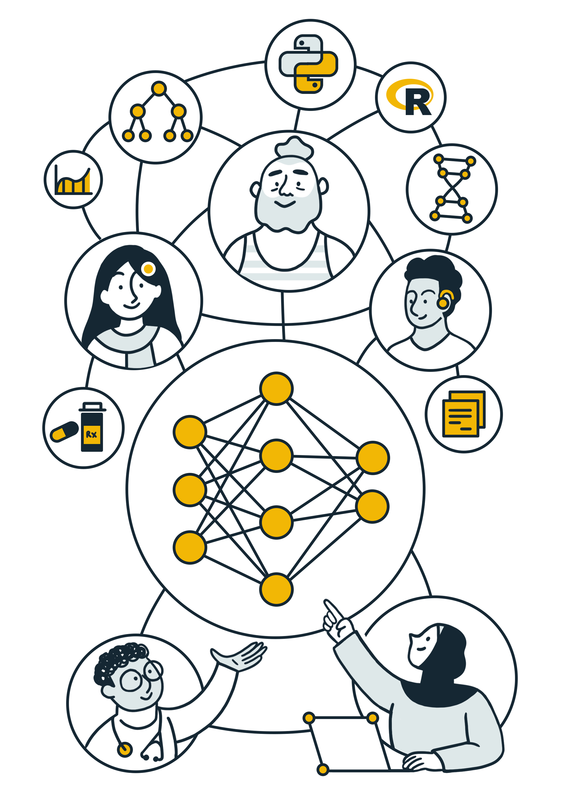

# Generating synthetic data 

There are multiple approaches to generating a synthetic dataset. The generation method could:

- Replicate statistical properties of real data (distribution, mean, range) 
- Add noise to real data (perturbing, shuffling, substituting) 	
- Use Machine Learning approaches (learn patterns in real data then generate new dataset)	

Different methods will achieve different levels of fidelity and privacy. 

## Before generating synthetic data 

Before generating a synthetic dataset is is important to consider whether there are **existing synthetic datasets** that meet your fidelity/quality/privacy requirements. See [3-synthetic-datasets-inventory.md](3-synthetic-datasets-inventory.md) for some existing synthetic datasets. If a dataset does not exist already, it is important to consider what **generation methodology** is important for your use-case, and re-use existing methods that have been created by others. There are **existing software and tools** that can help automate the generation of your synthetic datasets; some are listed below. 

##  Software 

The [ONS methodology working paper on synthetic data](https://www.ons.gov.uk/methodology/methodologicalpublications/generalmethodology/onsworkingpaperseries/onsmethodologyworkingpaperseriesnumber16syntheticdatapilot) is a good place to start. In Chapter 3, they give an overview of synthetic data software, describing web-based tools and software packages. They cover advantages and disadvantages of each tool separately, as well as providing an at-a-glance comparison table and a software decision chart. The tools and software they cover:
- SimPop (`R` package)
- Synthpop (`R` package)
- Sms (`R` package)
- Web-based tools such as Mackaroo
- Faker (`Python`)

---

A report by ADR UK and UKRI titled ['Accelerating public policy research with easier, safer synthetic data'](https://www.adruk.org/fileadmin/uploads/adruk/Documents/Accelerating_public_policy_research_with_synthetic_data_December_2021.pdf), has an accompanying `Python` [notebook](https://colab.research.google.com/drive/1xax64hSDf15WE8v49vpqaRUKDvjppXMQ) that makes it easy for a researcher to generate low-fidelity synthetic data. Also see their [related blog post](https://www.adruk.org/news-publications/news-blogs/accelerating-public-policy-research-with-easier-safer-synthetic-data/). 

---

The Alan Turing Institute has a project called QUiPP (Quantifying Utility and Preserving Privacy). See [their GitHub repository](https://github.com/alan-turing-institute/QUIPP-pipeline) for software pipelines that generate synthetic data, and [this page](https://www.turing.ac.uk/research/research-projects/quipp-quantifying-utility-and-preserving-privacy-synthetic-data-sets) which explains the project.

---

[TAPAS](https://github.com/alan-turing-institute/tapas) is a `Python` Toolbox for Adversarial Privacy Auditing of Synthetic Data. See also their [pre-print](https://arxiv.org/pdf/2211.06550.pdf)

---

[The Synthetic Population Catalyst (SPC)](https://alan-turing-institute.github.io/uatk-spc/) makes it easier for researchers to work with synthetic population data in England.

---

[SyntheaTM](https://github.com/synthetichealth/synthea) is a Synthetic Patient Population Simulator. Based on US data sources: US Census demographics, CDC rates and NIH reports. 

---

[Tofu](https://github.com/spiros/tofu) is a `Python` library for generating synthetic UK Biobank data.

---

[synthcity](https://github.com/vanderschaarlab/synthcity) is a `Python` library for generating and evaluating synthetic tabular data based on use-case and data modality. Read a summary report of this library [here](http://arxiv.org/abs/2301.07573).

---

[DataSynthesizer](https://github.com/DataResponsibly/DataSynthesizer) generates synthetic data that simulates a given dataset, applying differential privacy techniques.

