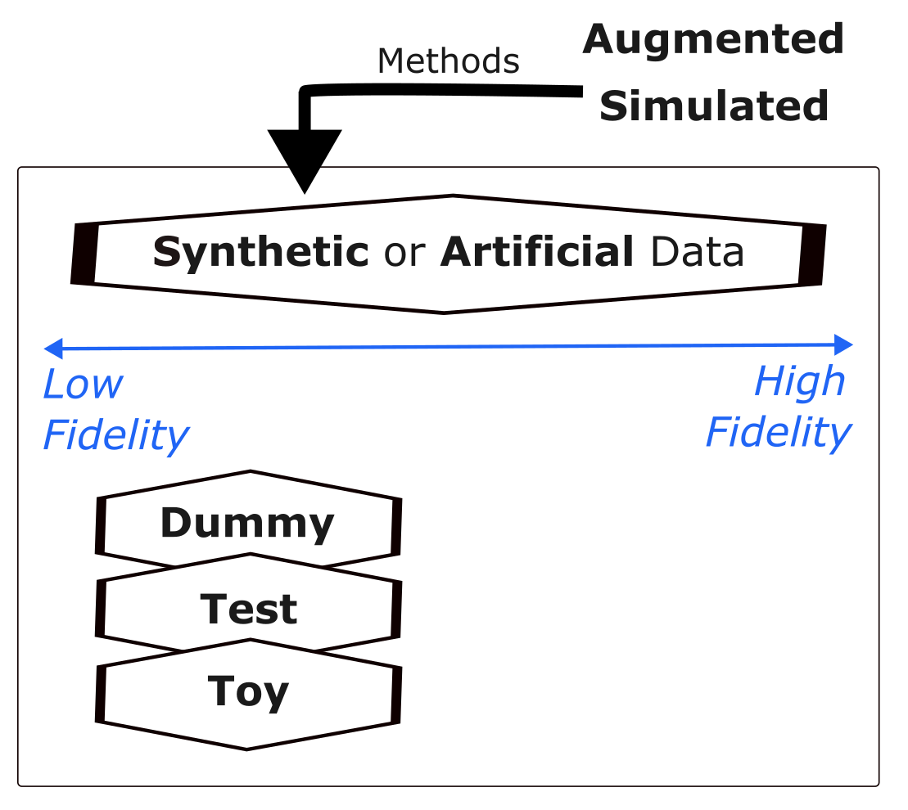
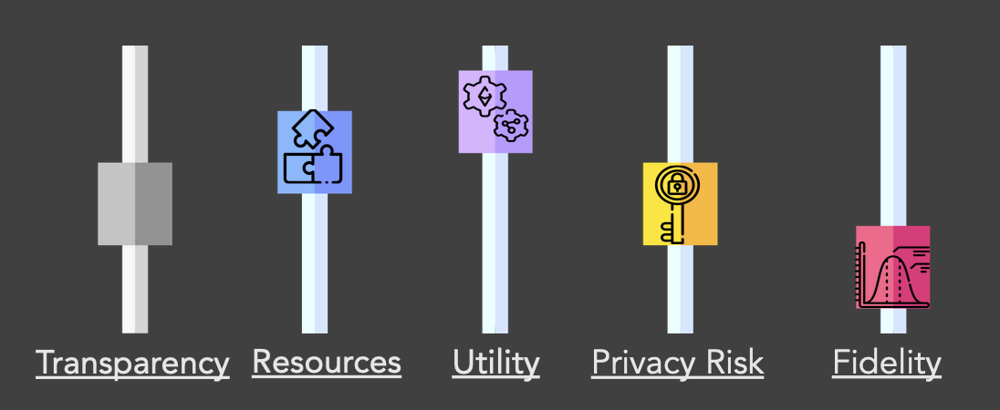

> This file a static version of this GitHub rep: https://github.com/aim-rsf/Synthetic-Data (version v0.2.2), with content edited to be suitable for a single PDF export.

> Please cite as: *Stickland, R., Mohammad M., Zormpa, E., Santos, L. & AIM-RSF team. (2025, version 0.2.2). Demystifying Synthetic Data. Zenodo: https://doi.org/10.5281/zenodo.14770429*

> This repository is shared under a [CC BY 4.0 licence](https://creativecommons.org/licenses/by/4.0/). It was created by the [AI for Multiple Long Term Conditions Research Support Facility (AIM-RSF)](https://www.turing.ac.uk/research/research-projects/ai-multiple-long-term-conditions-research-support-facility) (link to the [same archived website](https://web.archive.org/web/20250212145350/https://www.turing.ac.uk/research/research-projects/ai-for-multiple-long-term-conditions-research-support-facility?__cf_chl_rt_tk=XKaDrLiiU8hmzZk2rKaWDBVpnO8exVqC4EHijqlWTIQ-1739372030-1.0.1.1-hmHFksRkdOQcBH9PsOgRVdNAatQdr3i4hFOqtyPcyZU)). AIM RSF is funded by the NIHR Artificial Intelligence for Multiple Long-Term Conditions (AIM) programme (NIHR202647). The views expressed are those of the author(s) and not necessarily those of the NIHR or the DHSC.

# Demystifying Synthetic Data 

Synthetic data has great potential to speed up biomedical research. There are many detailed resources and references on synthetic data and its use-cases. This page aims to demystify the terminology used in this area and provide an introduction to key use-cases and challenges of synthetic data in health and biomedical research, with links to many examples and resources throughout. 

Contents:

1. [Questions and Answers](#questions-and-answers)
2. [Generating synthetic data](#generating-synthetic-data)
3. [Inventory of synthetic datasets](#inventory-of-synthetic-datasets)
4. [References and Resources](#references-and-resources)
5. [Licences](#licences)

# Questions and Answers

  
What is synthetic data?
  
   

  > Synthetic data are artificially generated data which replicate original features and patterns of real-world data.
  

 

  
How is synthetic data defined?
  
   

  > There are various definitions of synthetic data. Here are 3 examples:
  > 
  > "Synthetic data is data that has been generated using a purpose-built mathematical model or algorithm, with the aim of solving a (set of) data science task(s)."([Reference 5](#references-and-resources)) 
  > 
  > "Conceptually, synthetic data are artificial data that mimics the properties of and relationships in real data. The quality of synthetic data depends on the approach taken to synthetic data generation."([Reference 6](#references-and-resources)) 
  >
  > "Synthetic data are microdata records created to improve data utility while preventing disclosure of confidential respondent information. Synthetic data is created by statistically modelling original data and then using those models to generate new data values that reproduce the original data’s statistical properties …" Source: US Census Bureau, ([Reference 1](#references-and-resources)) 

  

 

  
Is synthetic data a recent development?
  
   

  > No. Using computer-generated data to solve tasks and generate new data is not a new idea; simulation and modelling approaches have been used for decades in science and technology spaces. However, newer developments relate to the growing application of synthetic data to manage the disclosure risk of sensitive health care data. 

 

  
Why can't we just use the real data? 
  
   
  
  > It can be confusing if 'made up' data is used instead of real data. In nearly all situations, the real data is what we should use to make final conclusions and decisions. However, there are points along the research process where it is challenging to use the real data (for example, privacy concerns) and a synthetic version (that matches the real data in some way but is not the real data) may help researchers and other users of this data.
  >
  > Health databases can contain sensitive personal information about a large group of people, making the hosting and sharing of these databases challenging. We do have some good anonymisation approaches to remove the risk of disclosure, however some risk will always remain. Accessing these databases can also cost money.
  > 
  > For these reasons above, and more, scientists working in health-care and biomedical research have sought to overcome some of these privacy concerns by generating synthetic versions of datasets of interest. In theory, the synthetic data should be safer and easier to access, therefore allowing researchers to learn the structure, features and patterns of the real dataset without actually accessing it directly. Easier and earlier access should facilitate promotion of these datasets, training of people and acceleration/refinement of research workflows. 
  > 
  > In the context of AI,  synthetic data that closely match the statistical properties of the real data can be used to train and validate machine learning models; synthetic datasets can be created to be different from the real data in specific ways to address a certain bias in the real data, for example under-sampling of sub-groups within a population.

  

  > *The Turing Way Community, & Scriberia. (2023). Illustrations from The Turing Way: Shared under CC-BY 4.0 for reuse. Zenodo. https://doi.org/10.5281/zenodo.7587336*

 

  
Synthetic, Artificial, Dummy, Test, Toy - are these all the same? 
  
   
  
  > Many terms are used interchangeably. Synthetic data and Artificial data typically refer to the same concept; often synthetic data is said to be artificially generated. Simulated data or Augmented data are sometimes used in replacement of synthetic data, but can be best thought of as methods used to generate the synthetic data i.e. via simulations and mathematical modelling. The low fidelity space can be less well defined and some people refer to this data as Dummy, Test or Toy data. These three are more likely to be randomly generated data, only matching the structure of the dataset and fewer of its statistical properties. More informal terms such as fake or made-up data are sometimes used.

  

  > *Created by the authors of this repo, some using [Flaticon](https://www.flaticon.com) free images in google slides.*

 

  
What is partially synthetic data?
  
   

  > Partially synthetic data (sometimes referred to as augmented data) incorporate real-world data. 
  > 
  > Fully synthetic data is created based on patterns learnt from real-world data, but does not use the real-world data directly.
  

 

  
What is the fidelity, utility and privacy of a synthetic dataset? How are they related? 
  
   
  
  > - Utility is how useful the synthetic dataset is for a specific task or tasks, which will be application-dependent
  > - Fidelity is the degree to which the synthetic dataset matches the statistical properties of the real data. Synthetic data is often categorised by the level of fidelity (low to high).
  > - Privacy is the amount of information the dataset contains about real data. Synthetic data can be created to mitigate disclosure risk (disclosure of confidential data about an individual).

  > *Created by the authors of this repo, some using [Flaticon](https://www.flaticon.com) free images in google slides.*

  > There are many dials/levers that a researcher can change when generating a synthetic dataset. Some of these are utility, fidelity and privacy risk, defined previously. When you change one dial, often another one changes. For instance, in general utility and fidelity change together and privacy risk increases with higher fidelity. However, not always! This is because privacy is dependent on the approach/methodology used to generate the synthetic data. Other important dials are the level of resources you have to generate the synthetic data, and how transparent the methodology of generation is (particularly relevant if explainable AI is used).

  

 

  
Is it always worth it to create synthetic data? What are they key challenges? 
  
   

  > - If the effort taken to make a good enough quality synthetic dataset is more than the effort to access anonymised real data, then it is often not worth it. It depends on what the synthetic data will be used for! 
  > - The quality of the real data can determine the quality of the synthetic data, retaining biases and errors.
  > - Though synthetic data is used to address bias and privacy risk it can also introduce these, if not created and used appropriately.
  > - We need to appropriately communicate what synthetic data is and isn't to different audiences, so that it is a trusted and accesible resource.
  > - We need to appropriately adapt data governance: it is not a replacement for real data, and should be easier to access and work with.
  > - Synthetic data has great potential in the context of the use of sensitive personal data in research, however synthetic data is not automatically private. For example, outliers remain hard to represent in a synthetic dataset in a private way, and evaluating the privacy of a model/dataset can be challenging. Privacy is a big topic - see [Reference 5](#references-and-resources).

  

  ## Generating synthetic data 
  
  There are multiple approaches to generating a synthetic dataset. The generation method could:
  
  - Replicate statistical properties of real data (distribution, mean, range) 
  - Add noise to real data (perturbing, shuffling, substituting) 	
  - Use Machine Learning approaches (learn patterns in real data then generate new dataset)	
  
  Different methods will achieve different levels of fidelity and privacy. 
  
  ### Before generating synthetic data 
  
  Before generating a synthetic dataset is is important to consider whether there are **existing synthetic datasets** that meet your fidelity/quality/privacy requirements. See [Inventory of synthetic datasets](#inventory-of-synthetic-datasets) for some existing synthetic datasets. If a dataset does not exist already, it is important to consider what **generation methodology** is important for your use-case, and re-use existing methods that have been created by others. There are **existing software and tools** that can help automate the generation of your synthetic datasets; some are listed below. 
  
  ###  Software 
  
  - The [ONS methodology working paper on synthetic data](https://www.ons.gov.uk/methodology/methodologicalpublications/generalmethodology/onsworkingpaperseries/onsmethodologyworkingpaperseriesnumber16syntheticdatapilot) is a good place to start. In Chapter 3, they give an overview of synthetic data software, describing web-based tools and software packages. They cover advantages and disadvantages of each tool separately, as well as providing an at-a-glance comparison table and a software decision chart. The tools and software they cover:
    - SimPop (`R` package)
    - Synthpop (`R` package)
    - Sms (`R` package)
    - Web-based tools such as Mackaroo
    - Faker (`Python`)
  - A report by ADR UK and UKRI titled ['Accelerating public policy research with easier, safer synthetic data'](https://www.adruk.org/fileadmin/uploads/adruk/Documents/Accelerating_public_policy_research_with_synthetic_data_December_2021.pdf), has an accompanying `Python` [notebook](https://colab.research.google.com/drive/1xax64hSDf15WE8v49vpqaRUKDvjppXMQ) that makes it easy for a researcher to generate low-fidelity synthetic data. Also see their [related blog post](https://www.adruk.org/news-publications/news-blogs/accelerating-public-policy-research-with-easier-safer-synthetic-data/). 
  - The Alan Turing Institute has a project called QUiPP (Quantifying Utility and Preserving Privacy). See [their GitHub repository](https://github.com/alan-turing-institute/QUIPP-pipeline) for software pipelines that generate synthetic data, and [this page](https://www.turing.ac.uk/research/research-projects/quipp-quantifying-utility-and-preserving-privacy-synthetic-data-sets) which explains the project.
  - [TAPAS](https://github.com/alan-turing-institute/tapas) is a `Python` Toolbox for Adversarial Privacy Auditing of Synthetic Data. See also their [pre-print](https://arxiv.org/pdf/2211.06550.pdf)
  - [The Synthetic Population Catalyst (SPC)](https://alan-turing-institute.github.io/uatk-spc/) makes it easier for researchers to work with synthetic population data in England.
  - [SyntheaTM](https://github.com/synthetichealth/synthea) is a Synthetic Patient Population Simulator. Based on US data sources: US Census demographics, CDC rates and NIH reports. 
  - [Tofu](https://github.com/spiros/tofu) is a `Python` library for generating synthetic UK Biobank data.
  - [synthcity](https://github.com/vanderschaarlab/synthcity) is a `Python` library for generating and evaluating synthetic tabular data based on use-case and data modality. Read a summary report of this library [here](http://arxiv.org/abs/2301.07573).
  - [DataSynthesizer](https://github.com/DataResponsibly/DataSynthesizer) generates synthetic data that simulates a given dataset, applying differential privacy techniques.

 ## Inventory of synthetic datasets

Data providers are creating synthetic versions of their datasets, for various different purposes. Below we list some synthetic datasets related to health research (not an exhaustive list, just some key examples).

### Clinical Practice Research Datalink (CPRD)

- CPRD offer [4 synthetic datasets](https://cprd.com/synthetic-data) based on their two separate primary care databases, [Aurum and GOLD](https://cprd.com/primary-care-data-public-health-research).
- A data licence agreement must be completed, in order to access these synthetic datasets. 
- The four datasets:
  - *CPRD cardiovascular disease synthetic dataset* based on CPRD Aurum database (high fidelity) - a small cost
  - *CPRD COVID-19 symptoms and risk factors synthetic dataset* based on CPRD Aurum database (high fidelity) - a small cost
  - *CPRD Aurum sample dataset* based on CPRD Aurum database (medium fidelity) - free!
  - *CPRD GOLD sample dataset* based on CPRD GOLD database (medium fidelity) - free!

### UK Biobank
- [UK Biobank](https://www.ukbiobank.ac.uk) offer [one low fidelity dataset](https://biobank.ndph.ox.ac.uk/ukb/exinfo.cgi?src=UKB_Synthetic_Dataset.html), at similar size and structure to the real dataset, with values generated at random.
- There appears to be no cost for this dataset, and it can be downloaded from the website directly. 
<!--/ https://biobank.ndph.ox.ac.uk/~bbdatan/UKB_Synthetic_Dataset_Methods_Summary.pdf -->

### NHS
- [The NHSE Data Science Case Studies](https://nhsengland.github.io/DataScience-CaseStudies) offer code & methods to generate synthetic data.
- [NHS Digital ran an Artificial data pilot](https://digital.nhs.uk/services/artificial-data), creating three synthetic datasets based on Hospital Episode Statistics (from NHS Hospitals across England).
- [NHS England share a synthetic version of A&E data](https://data.england.nhs.uk/dataset/a-e-synthetic-data)
- There appears to be no cost for these datasets, and they can be downloaded from the websites directly. 

## References and Resources 

Many others are hyperlinked throughout the text!

1. Bates, A. G., Spakulová, I., Dove, I., & Mealor, A. (2019). [ONS methodology working paper series number 16—Synthetic data pilot](https://www.ons.gov.uk/methodology/methodologicalpublications/generalmethodology/onsworkingpaperseries/onsmethodologyworkingpaperseriesnumber16syntheticdatapilot).
2. Calcraft, P., Thomas, I., Maglicic, M., & Sutherland, A. (2021). [Accelerating public policy research with synthetic data](https://www.adruk.org/fileadmin/uploads/adruk/Documents/Accelerating_public_policy_research_with_synthetic_data_December_2021.pdf).
3. Giuffrè, M., & Shung, D. L. (2023). [Harnessing the power of synthetic data in healthcare: innovation, application, and privacy](https://doi.org/10.1038/s41746-023-00927-3). NPJ Digital Medicine, 6(1), 186. 
4. Gonzales, A., Guruswamy, G., & Smith, S. R. (2023). [Synthetic data in health care: a narrative review](https://doi.org/10.1371/journal.pdig.0000082). PLOS Digit Health 2(1): e0000082.
5. Jordon, J., Szpruch, L., Houssiau, F., Bottarelli, M., Cherubin, G., Maple, C., ... & Weller, A. (2022). [Synthetic Data--what, why and how?](https://arxiv.org/pdf/2205.03257.pdf)
6. Myles, P., Ordish, J., & Branson, R. (2021). [Synthetic data and the innovation, assessment, and regulation of AI medical devices](https://cprd.com/sites/default/files/2022-12/Myles%20et%20al.%20preprint_2022.pdf).

